# Karsten Errando Winoto — Portfolio

## 📌 Projects

- [Project 1: HeartGuard](#project-1-heart-guard)
- [Project 2: Transformer Leopard Gecko](#project-2-transformer-leopard-gecko)
- [Project 3: Cooperative App](#project-3-cooperative-app)
- [Project 4: ECG Heart Disease Classification](#project-4-ecg-heart-disease-classification-with-deep-learning)

---

# [Project 1: HeartGuard](https://github.com/sixxkr/heartguard)

This is a project I developed for my **Mobile Application Programming** course at university, where I built a mobile application that integrates a machine learning model for heart disease classification.

- Dataset: [Kaggle Heart Disease Dataset](https://www.kaggle.com/datasets/johnsmith88/heart-disease-dataset)
- Model: Random Forest
- Frontend: Flutter framework
- Backend: Local API built with Flask (integrated with the ML model)

## 📱 Mobile App Layout

&nbsp;&nbsp;&nbsp;

## 📊 Model Accuracy

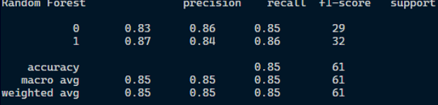

---

# [Project 2: Transformer Leopard Gecko](https://github.com/sixxkr/Transformer_Leopard-Gecko)

This is a project I completed for my **Pattern Recognition** course as the final project. The goal was to classify Leopard Gecko morphs using a Transformer-based model.

- Classes:
  - `Boldstripe`
  - `Albino`
  - `Albino Boldstripe`
- Dataset: ~60 images collected manually (Google, Instagram, etc.)
- Architecture: Transformer
- Training: 100 epochs
- Achieved test accuracy: **41%**

## 🗂️ Dataset Samples

- **Boldstripe**  
  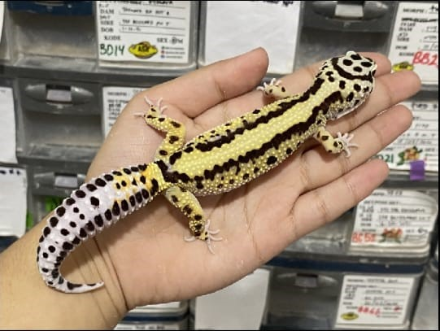

- **Albino**  
  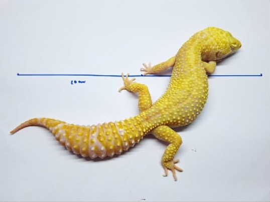

- **Albino Boldstripe**  
  

## 🧪 Evaluation Results

- **Test Accuracy**  
  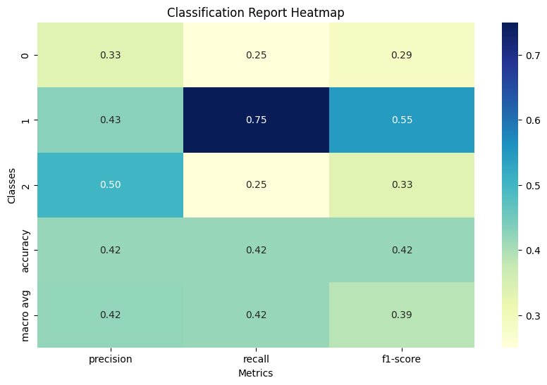

- **Train Accuracy and Loss**  
  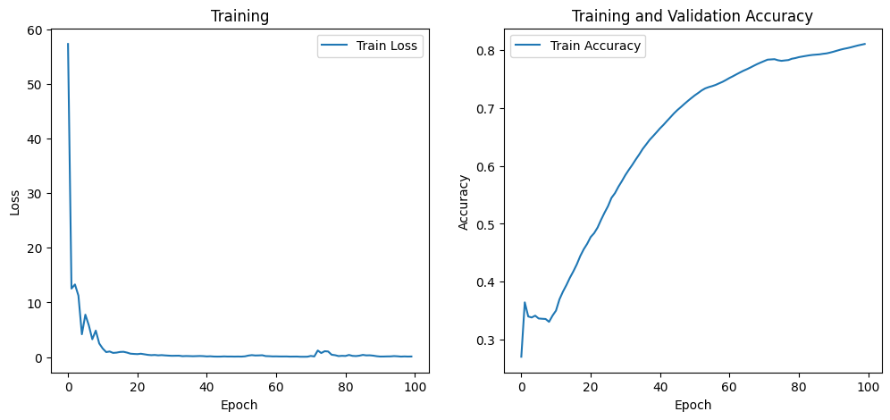

---

# [Project 3: Cooperative App](https://github.com/sixxkr/app_koperasi)

This is a mobile cooperative application I built during my internship at **Dua Kelinci**.  
It allows factory employees to browse products, manage shopping carts, perform checkouts, and view transaction history.

### 🔧 Tech Stack

- **Frontend:** Flutter (Android/iOS)
- **Backend:** Flask (RESTful API)
- **Database:** MySQL

### ⚙️ Core Features

- Product catalog browsing with detailed views
- Add to cart, update quantities, and remove items
- Checkout flow with order summary and payment-ready integration
- Transaction history with order status tracking
- User authentication (login/logout, session management)

### 🏗️ Architecture

- RESTful API built with Flask
- Persistent storage in MySQL
- Frontend–backend communication via JSON over HTTPS

---

# [Project 4: ECG Heart Disease Classification with Deep Learning](https://github.com/sixxkr/ECG-Classification)

This is my **Final Thesis project**, where I developed a classification model for heart disease based on ECG signal amplitudes using multiple deep learning methods.

## 📊 Dataset

- Source: [Kaggle - ECG Heartbeat Categorization Dataset](https://www.kaggle.com/datasets/shayanfazeli/heartbeat)
- Training set: 87,554 samples
- Testing set: 21,892 samples
- Each ECG signal length: 1870 ms (120 Hz sampling rate)

### Class Distribution (before preprocessing)

| Class                             | Training   | Testing    |
| --------------------------------- | ---------- | ---------- |
| Normal                            | 72,471     | 18,118     |
| Fusion of paced and normal        | 6,431      | 1,608      |
| Premature ventricular contraction | 5,788      | 1,448      |
| Atrial Premature                  | 2,223      | 556        |
| Fusion of ventricular and normal  | 641        | 162        |
| **Total**                         | **87,554** | **21,892** |

### Class Distribution (after splitting)

| Class                             | Training   | Validation | Testing    |
| --------------------------------- | ---------- | ---------- | ---------- |
| Normal                            | 57,892     | 14,579     | 18,118     |
| Fusion of paced and normal        | 5,182      | 1,249      | 1,608      |
| Premature ventricular contraction | 4,676      | 1,112      | 1,448      |
| Atrial Premature                  | 1,797      | 426        | 556        |
| Fusion of ventricular and normal  | 496        | 145        | 162        |
| **Total**                         | **70,043** | **17,511** | **21,892** |

### Signal Samples

- **Normal**  
  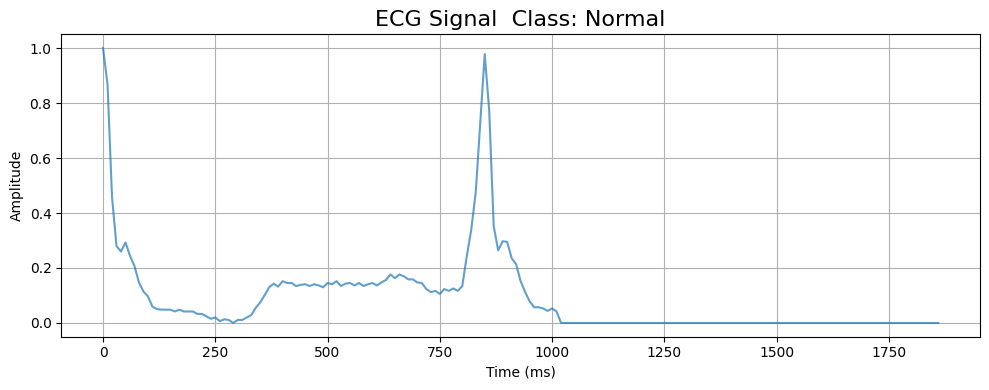

- **Atrial Premature**  
  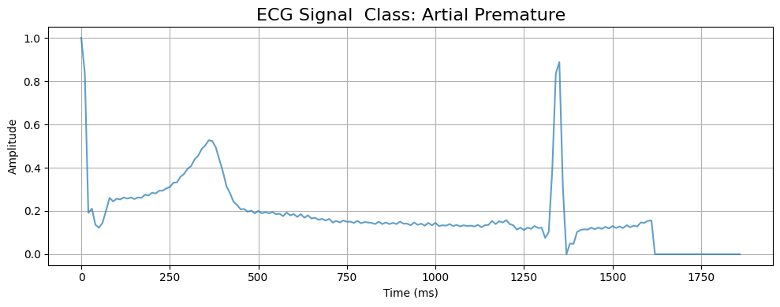

- **Premature Ventricular Contraction**  
  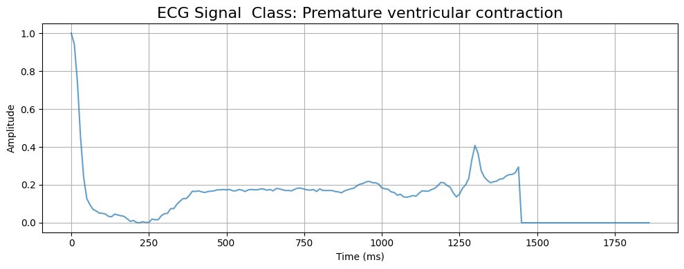

- **Fusion of Ventricular and Normal**  
  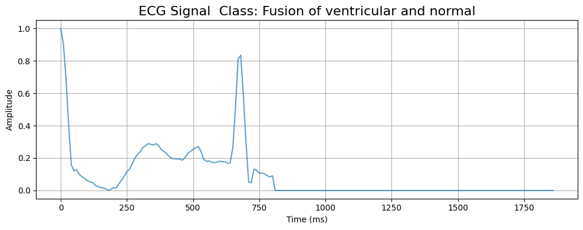

- **Fusion of Paced and Normal**  
  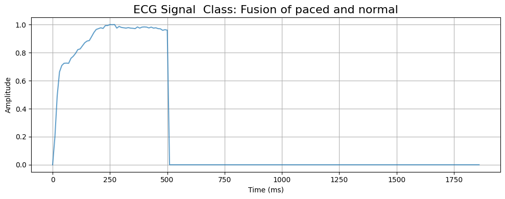

## 🏗️ Models Used

- **CNN1D (Convolutional Neural Network)**  
  

- **RNN (Recurrent Neural Network)**  
  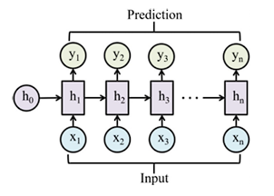

- **LSTM (Long Short-Term Memory)**  
  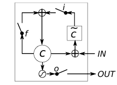

- **GRU (Gated Recurrent Unit)**  
  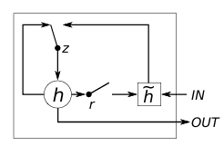

## 📈 Model Evaluation

### Training Performance

- **CNN**  
  

- **RNN**  
  

- **LSTM**  
  

- **GRU**  
  

### Testing Performance

- **CNN**  
  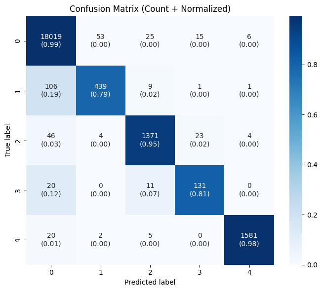

- **RNN**  
  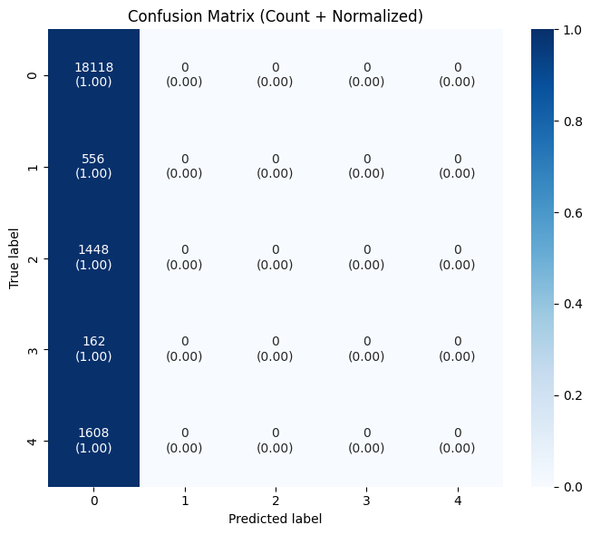

- **LSTM**  
  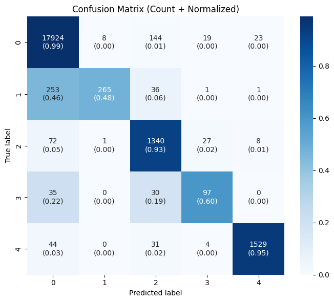

- **GRU**  
  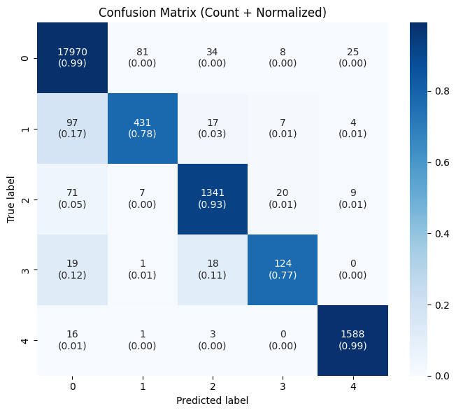

### Final Results

| Model | Accuracy | Precision | Recall | F1-Score |
| ----- | -------- | --------- | ------ | -------- |
| CNN   | 0.98     | 0.92      | 0.90   | 0.91     |
| RNN   | 0.83     | 0.17      | 0.20   | 0.18     |
| LSTM  | 0.97     | 0.89      | 0.79   | 0.82     |
| GRU   | 0.98     | 0.90      | 0.89   | 0.90     |

**Key Insight:** CNN and GRU achieved the best performance with 98% accuracy, while RNN underperformed due to underfitting.

---
